# HikeBuddy 

> Where every step tells a story.

## Authentication 
> ### You can create an account or log in to an existing one
  

  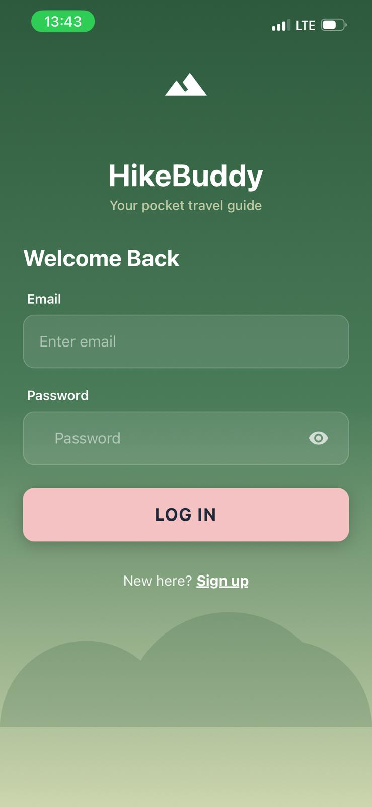
  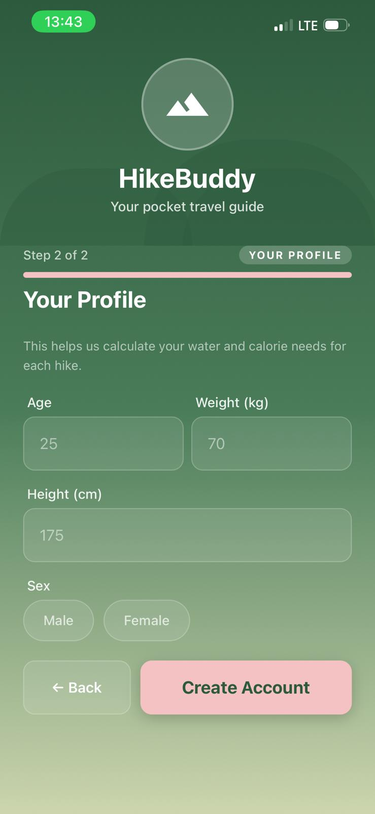
  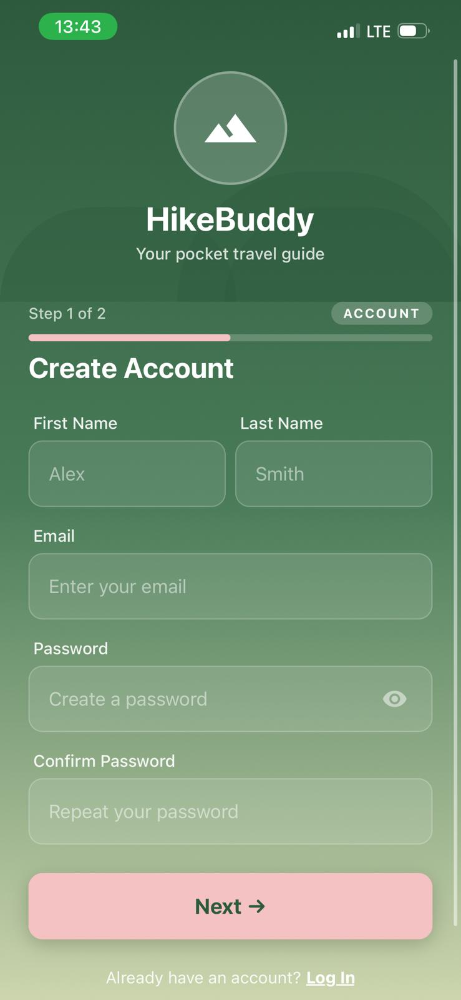

## Hike smarter, not harder
> ### On the Home Screen, you can access all available trails, filter them by your preferences, and start your journey

  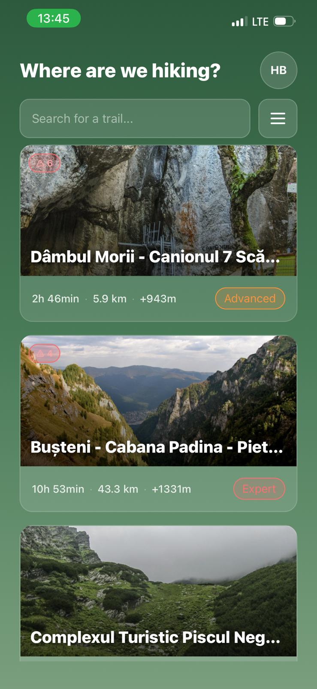
  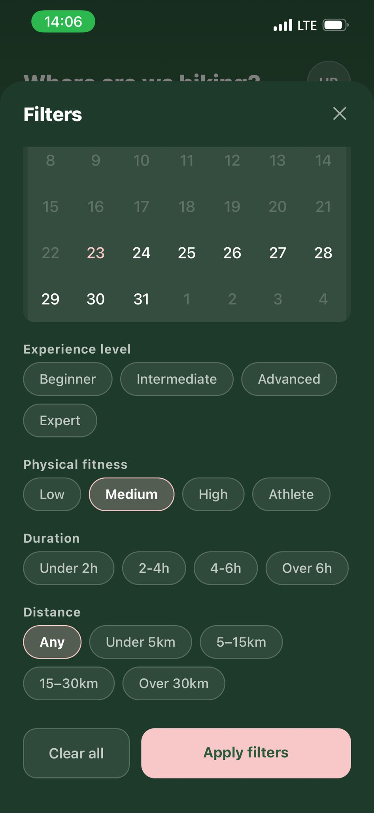
  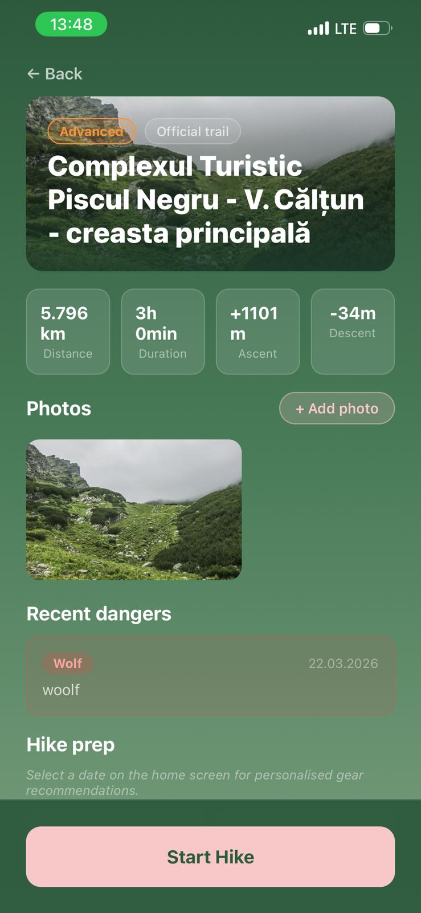
  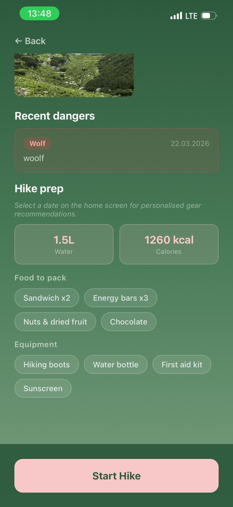
  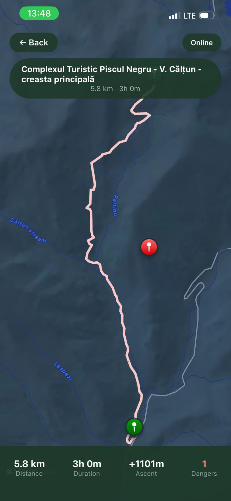

> ### If you encounter any danger on the trail, you can easily alert other users by long-pressing on the screen

  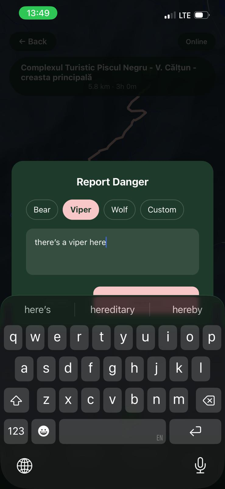
  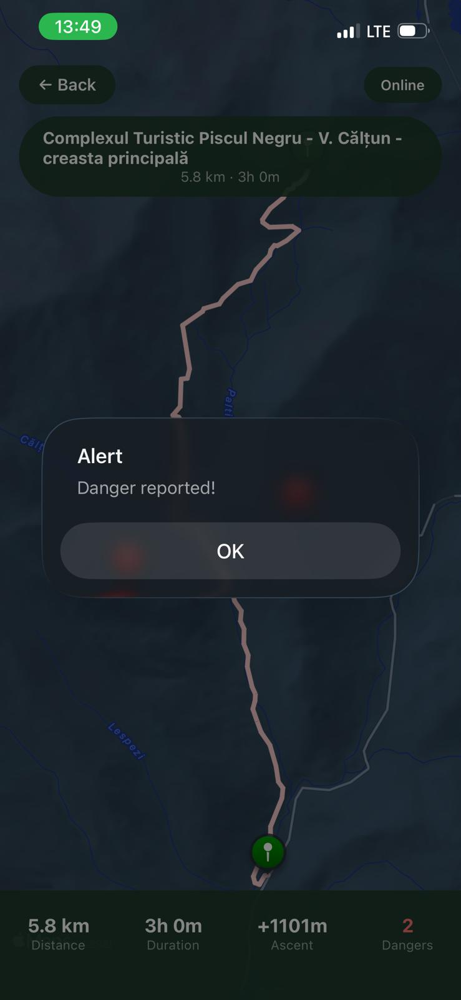

> ### The app allows you to send an alert even if there is no signal; once the connection is restored, the ping is uploaded to the map

  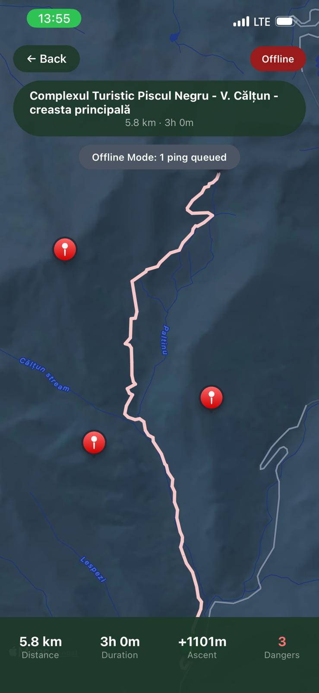
  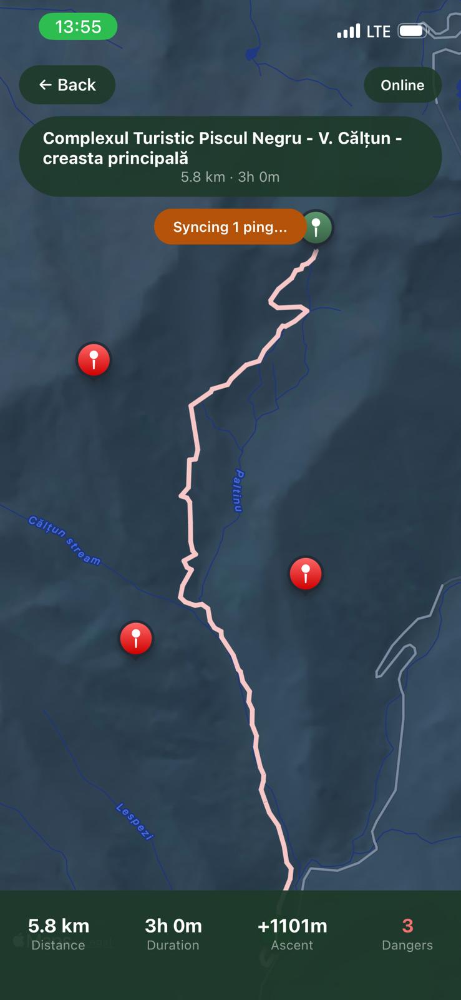

## Profile page
> ### You can edit your profile or add new information to it

  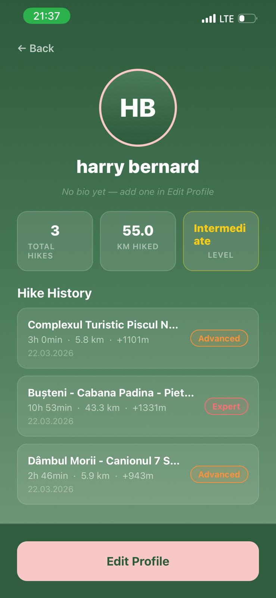
  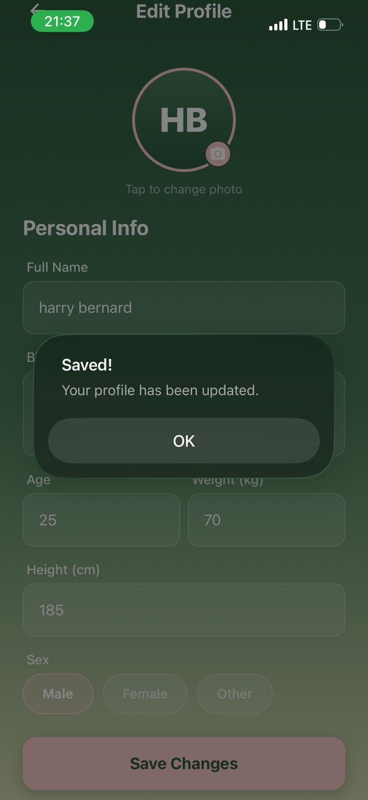

