# HikeBuddy 

HikeBuddy is a mobile app that helps beginner hikers before and during their hiking experience. It provides trail, food, and water quantity recommendations based on each user's personal characteristics (age, weight, sex) and the hike they choose. It also features real-time danger alerts reported by other hikers or weather forecasts, gear suggestions, and live trail tracking.

> Where every step tells a story.

## Authentication 
> ### You can create an account or log in to an existing one
  
<div style="flex-direction:row;">
  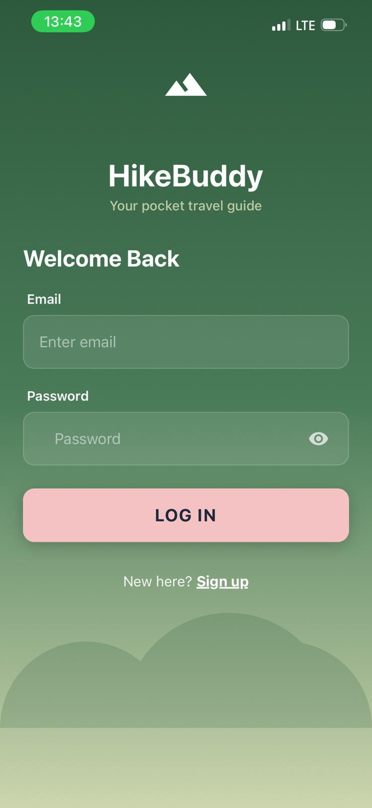
  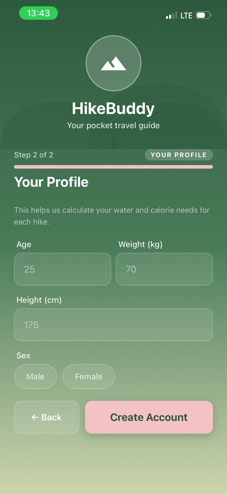
  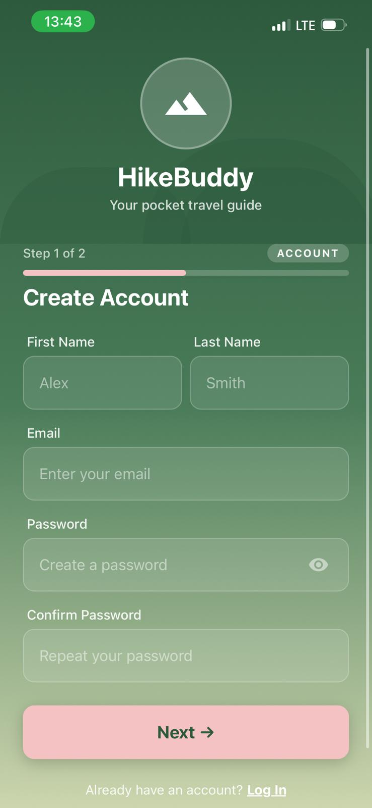
</div>

## Hike smarter, not harder
> ### On the Home Screen, you can access all available trails, filter them by your preferences, and start your journey

<p style="flex-direction:row;">
  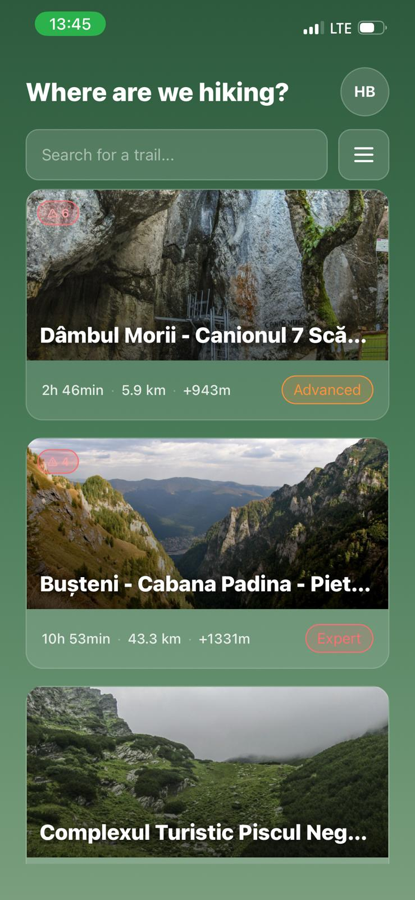
  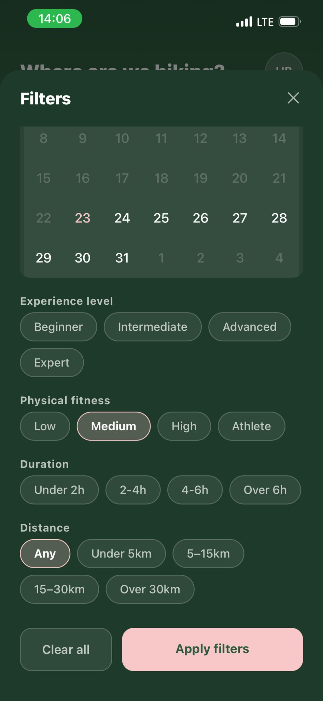
  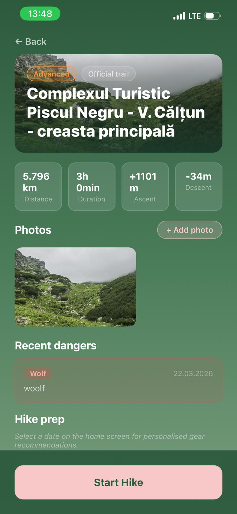
  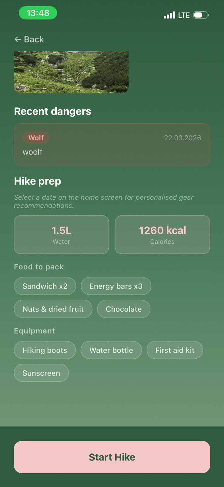
  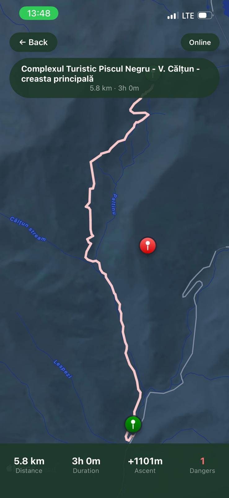
</p>

> ### If you encounter any danger on the trail, you can easily alert other users by long-pressing on the screen

<p style="flex-direction:row;">
  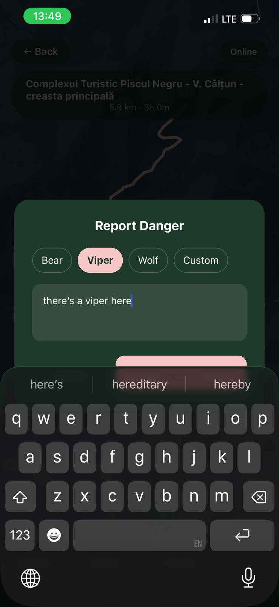
  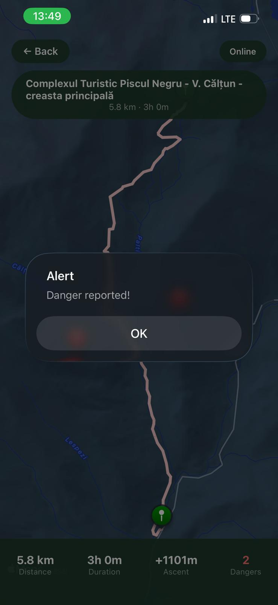
</p>

> ### The app allows you to send an alert even if there is no signal; once the connection is restored, the ping is uploaded to the map

<p style="flex-direction:row;">
  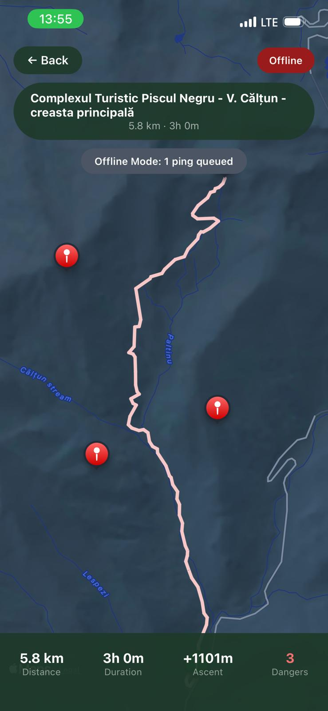
  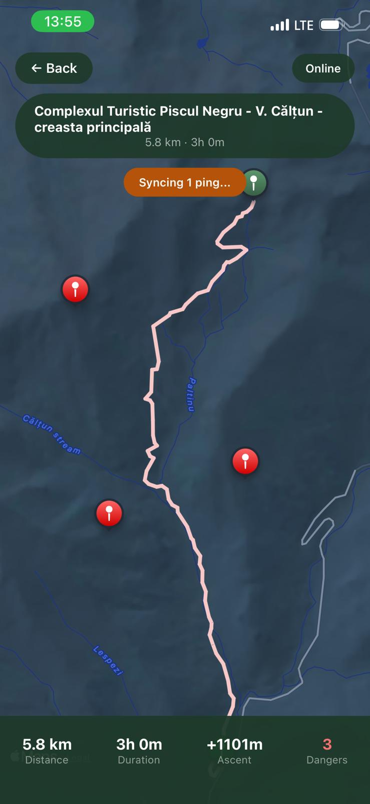
</p>

## Profile page
> ### You can edit your profile or add new information to it

<p style="flex-direction:row;">
  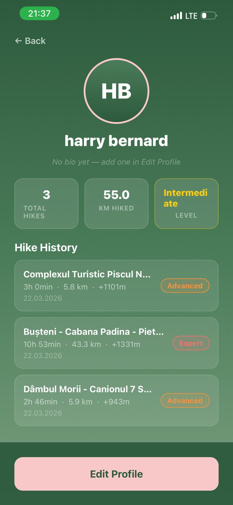
  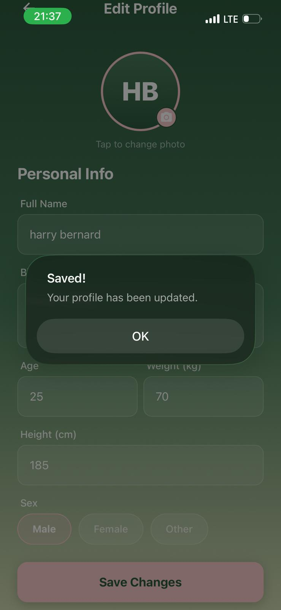
</p>

## Features

- **Trail Discovery** — Browse trails filtered by difficulty, duration, and fitness level
- **Trail Details** — View distance, ascent, descent, duration, and weather forecast for your chosen hike date
- **Gear & Nutrition Suggestions** — Personalized equipment, food, and water recommendations based on your body stats and trail difficulty
- **Live Map** — Follow your route on an interactive map with real-time GPS tracking
- **Danger Reporting** — Report hazards (bears, wolves, trail damage) directly on the map to warn other hikers
- **Community Pings** — See dangers reported by other hikers on your trail

## Tech Stack

| Layer | Technology |
|-------|-----------|
| Frontend | React Native (Expo) |
| Backend | FastAPI (Python) |
| Database | Supabase (PostgreSQL) |
| Maps | react-native-maps |

## Getting Started

### Prerequisites
- Node.js
- Python 3.9+
- Expo Go app on your phone

### Frontend
```bash
cd hikeBuddyApp
npm install
npx expo start
```

### Backend
```bash
cd backend
pip install -r requirements.txt
uvicorn main:app --reload --port 8000
```

## How It Works

1. **Sign up** with your personal details (age, weight, height, sex)
2. **Browse trails** and filter by difficulty, duration, and fitness level
3. **Select a date** to get personalized weather forecasts and gear recommendations
4. **Start your hike** and follow your route on the live map
5. **Report dangers** you encounter to help other hikers stay safe
